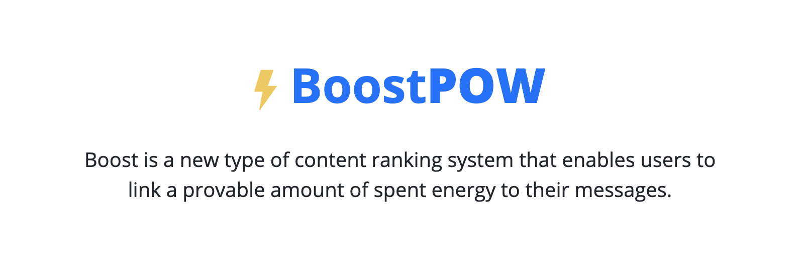

# Boost POW Javascript Library
> Boost Proof of Work Protocol
> https://boostpow.com

Boost is a new type of content ranking system that enables users to increase the amount of energy required to mine or process their content. Users will boost their post as a way to signal to the network that they believe their information is valuable. Boosted posts will appear in the boost feed – ordered by the amount of energy requested for their information.



---

## Preview

A Boost Pow String (also called "Boost Header") consist of an 80 byte string that is encoded identically to a Bitcoin Block Header.  The string is valid if the hash256 of the string is less than the target difficulty specified inside the string.

We can objectively order content of Boost Pow Strings from most to least energy (difficulty) in a way that is self-evident and provable. The world's first provably fair content ranking system powered by native Bitcoin Proof of Work.

**Boost Pow String:**
```
010000009500c43a25c624520b5100adf82cb9f9da72fd2447a496bc600b0000000000006cd862370395dedf1da2841ccda0fc489e3039de5f1ccddef0e834991a65600ea6c8cb4db3936a1ae3143991
```
And it's hash256 is: **0000000000002917ed80650c6174aac8dfc46f5fe36480aaef682ff6cd83c3ca**

**Sample code to verify Boost Pow String**:
```javascript
// Validate a Boost Pow String
// Underneath bsv.js validates the string *exactly* like a Bitcoin Block Header
const powString = boost.BoostPowString.fromString('010000009500c43a25c624520b5100adf82cb9f9da72fd2447a496bc600b0000000000006cd862370395dedf1da2841ccda0fc489e3039de5f1ccddef0e834991a65600ea6c8cb4db3936a1ae3143991');
// Print out the decoded string
console.log(powString.toObject());
/*
{
    hash: '0000000086915e291fe43f10bdd8232f65e6eb64628bbb4d128be3836c21b6cc',
    content: '00000000000000000000000000000000000000000048656c6c6f20776f726c64',
    bits: 486604799,
    difficulty: 1,
    metadataHash: "acd8278e84b037c47565df65a981d72fb09be5262e8783d4cf4e42633615962a",
    time: 1305200806,
    nonce: 3698479534,
    category: 1,
}
*/
```

## Installation

```sh
npm install boostpow-js --save
```

# Boost POW

**A Protocol for Buying and Selling Proof-of-Work Embedded in Bitcoin Script**

<a href='https://boostpow.com/'>boostpow.com</a>

Boost is a new type of content ranking system that enables users to increase the amount of energy required to mine or process their content. Users will boost their post as a way to signal to the network that they believe their information is valuable. Boosted posts will appear in the boost feed – ordered by the amount of energy requested for their information.

**Links**:

- <a href='https://github.com/matterpool/boostpow-js'>Javascript SDK: boostpow-js</a>
- <a href='https://github.com/matterpool/boostpow-api'>Standalone API Server: boostpow-api</a>
- <a href='https://media.bitcoinfiles.org/52fb4bedc85854638af61a7f906bf8e93da847d2ddb522b1aec53cfc6a0b2023'>Whitepaper</a>

## MoneyButton, Relay, TwetchPay Integration

Easily integrate <a href='https://moneybutton.com'>MoneyButton</a>, <a href='https://relayx.io'>Relay</a>, and <a href='https://pay.twetch.com/docs'>TwetchPay</a>

Consult the respective documentation for additional details. All services support the 'outputs' format presented below for easy integration.

```javascript
const boost = require('boostpow-js');
// Create a Boost request with your data
const boostJob = boost.BoostPowJob.fromObject({
  content: Buffer.from('hello world', 'utf8').toString('hex'),
  diff: 1, // Minimum '1'. Specifies how much hashrate. 1 = difficulty of Bitcoin Genesis (7 MH/second)
  category: Buffer.from('B', 'utf8').toString('hex'),
  additionalData: Buffer.from(`{ "foo": 1234, "metadata": "hello"}`, 'utf8').toString('hex'),
  userNonce: Buffer.from(Math.random(999999999), 'utf8').toString('hex'),
  tag: Buffer.from('funny-animals', 'utf8').toString('hex'),
});
// Construct a MoneyButton or Relay Output
const boostOutputs = [{
  script: boostJob.toASM(),
  amount: boostJob.getDiff() * 0.0001, // Charge a fee for the Boost. In future this will be a feeQuote system. Higher payout the more likely a miner will mine the boost relativity to the diff.
  currency: "BSV"
}];

// Now you can populate MoneyButton, Relay or TwetchPay with the outputs:
twetchPay.pay({
  label: 'Boost Content',
  outputs: boostOutputs,
  onPayment: async (e) => {
    console.log('payment completed', e);
    // Optionally submit to the graph database for indexing
    // In the future a planaria will pick it up automatically on-chain, for now submit the rawtx
    const boostRequestSubmit = await boost.Graph().submitBoostJob(e.rawtx);
    console.log('boostRequestSubmit', boostRequestSubmit);
  }
});

```

> The above command returns JSON structured like this after successfully submitting.

```json
{
  "success": true,
  "result": {
    "boostPowString": null,
    "boostPowMetadata": null,
    "boostHash": null,
    "boostJobId": "cdd2822902bcc90bd6e4651475e2476034700353e7a0335a42783c1a1050d267.0",
    "boostJobProofId": null,
    "boostJob": {
      "boostJobId": "cdd2822902bcc90bd6e4651475e2476034700353e7a0335a42783c1a1050d267.0",
      "createdTime": 1586125104,
      "txid": "cdd2822902bcc90bd6e4651475e2476034700353e7a0335a42783c1a1050d267",
      "vout": 0,
      "scripthash": "b94f7355830581e0776d91b752bcea9856d4f5b6d0fbccb9d5628fff16180fce",
      "value": 10000,
      "diff": 1,
      "rawtx": "01000000026d78236444e4ffcae65b0b7ac467774ee9bb9bf233022231f918195056990504050000006a47304402204c41bfabb9a6114a1bb9472f9eeffceb4fe809aa2724dc5cb01d02b230a7c79102202bbe6bfae1c7ef183f060377ad1bfd36dc45a8fcc9dd5aad36f0b079b4cc0e374121021de3f773245db6d0aa1fa0a45483226e1dc4245fbf107dafe6614a5619700534ffffffff0e8358d2a0695438ca0086748c5eca4920a21c3412f9215389befc024341a61f030000006a4730440220136058bf2a4968f1aa6c1fb838ddb3addc09c4a0a5e0ab799eafa863c6da370c02204b81d1957c7f091b35c00f3baa4f1cc144208e42753b61457915f39cbdff4fd14121027651f21529831fc06155b71d1e673dccecdec87b9327367c8f3f4d6e6cdd484cffffffff021027000000000000e108626f6f7374706f7775040000000020747365742061207369207369687400000000000000000000000000000000000004ffff001d14000000000000000000000000000000000000000004000000002000000000000000000000000000000000000000000000000000000000000000007e7c557a766b7e52796b557a8254887e557a8258887e7c7eaa7c6b7e7e7c8254887e6c7e7c8254887eaa01007e816c825488537f7681530121a5696b768100a0691d00000000000000000000000000000000000000000000000000000000007e6c539458959901007e819f6976a96c88ac783c0000000000001976a9141c0a355b69698600f78cccd184c2cee02206c99188ac00000000",
      "spentTxid": null,
      "spentVout": 0,
      "spentRawtx": null,
      "spentScripthash": null
    },
    "boostData": {
      "categoryutf8": "",
      "category": "00000000",
      "contentutf8": "this is a test",
      "content": "0000000000000000000000000000000000007468697320697320612074657374",
      "tagutf8": "",
      "tag": "0000000000000000000000000000000000000000",
      "usernonce": "00000000",
      "additionaldatautf8": "",
      "additionaldata": "0000000000000000000000000000000000000000000000000000000000000000"
    }
  }
}

```

## Create Boost Job

Create Boost Job Request.


<a href='https://github.com/MatterPool/boostpow-js/tree/master/test'>See unit tests for more examples</a>


```shell
curl -X POST https://graph.boostpow.com/api/v1/main/boost/jobs -H 'Content-Type: application/json' \
-d '{ "rawtx": "...raw tx hex containing boost output..."}'

```

```javascript
const boost = require('boostpow-js');
const result = await boost.Graph().submitBoostJob('...rawboost tx...');
```

> The above command returns JSON structured like this:

```json
{
  "success": true,
  "result": {
    "boostPowString": null,
    "boostPowMetadata": null,
    "boostHash": null,
    "boostJobId": "cdd2822902bcc90bd6e4651475e2476034700353e7a0335a42783c1a1050d267.0",
    "boostJobProofId": null,
    "boostJob": {
      "boostJobId": "cdd2822902bcc90bd6e4651475e2476034700353e7a0335a42783c1a1050d267.0",
      "createdTime": 1586125104,
      "txid": "cdd2822902bcc90bd6e4651475e2476034700353e7a0335a42783c1a1050d267",
      "vout": 0,
      "scripthash": "b94f7355830581e0776d91b752bcea9856d4f5b6d0fbccb9d5628fff16180fce",
      "value": 10000,
      "diff": 1,
      "rawtx": "01000000026d78236444e4ffcae65b0b7ac467774ee9bb9bf233022231f918195056990504050000006a47304402204c41bfabb9a6114a1bb9472f9eeffceb4fe809aa2724dc5cb01d02b230a7c79102202bbe6bfae1c7ef183f060377ad1bfd36dc45a8fcc9dd5aad36f0b079b4cc0e374121021de3f773245db6d0aa1fa0a45483226e1dc4245fbf107dafe6614a5619700534ffffffff0e8358d2a0695438ca0086748c5eca4920a21c3412f9215389befc024341a61f030000006a4730440220136058bf2a4968f1aa6c1fb838ddb3addc09c4a0a5e0ab799eafa863c6da370c02204b81d1957c7f091b35c00f3baa4f1cc144208e42753b61457915f39cbdff4fd14121027651f21529831fc06155b71d1e673dccecdec87b9327367c8f3f4d6e6cdd484cffffffff021027000000000000e108626f6f7374706f7775040000000020747365742061207369207369687400000000000000000000000000000000000004ffff001d14000000000000000000000000000000000000000004000000002000000000000000000000000000000000000000000000000000000000000000007e7c557a766b7e52796b557a8254887e557a8258887e7c7eaa7c6b7e7e7c8254887e6c7e7c8254887eaa01007e816c825488537f7681530121a5696b768100a0691d00000000000000000000000000000000000000000000000000000000007e6c539458959901007e819f6976a96c88ac783c0000000000001976a9141c0a355b69698600f78cccd184c2cee02206c99188ac00000000",
      "spentTxid": null,
      "spentVout": 0,
      "spentRawtx": null,
      "spentScripthash": null
    },
    "boostData": {
      "categoryutf8": "",
      "category": "00000000",
      "contentutf8": "this is a test",
      "content": "0000000000000000000000000000000000007468697320697320612074657374",
      "tagutf8": "",
      "tag": "0000000000000000000000000000000000000000",
      "usernonce": "00000000",
      "additionaldatautf8": "",
      "additionaldata": "0000000000000000000000000000000000000000000000000000000000000000"
    }
  }
}

```

This endpoint retrieves found Boosts matching the search querie

### HTTP Request

`POST https://graph.boostpow.com/api/v1/main/boost/jobs`

### URL Parameters

Parameter | Description
--------- | -----------
rawtx |  Raw boost tx

## Get Boost Job Status

Get Boost Job Status. Returns the status of a Boost Job. If it's mined you will see the 'boostPowString' and other fields populated.

<a href='https://github.com/MatterPool/boostpow-js/tree/master/test'>See unit tests for more examples</a>

```shell
curl  https://graph.boostpow.com/api/v1/main/boost/jobs/cdd2822902bcc90bd6e4651475e2476034700353e7a0335a42783c1a1050d267

```

```javascript
const boost = require('boostpow-js');
const result = await boost.Graph().getBoostJobStatus('cdd2822902bcc90bd6e4651475e2476034700353e7a0335a42783c1a1050d267');
```

> The above command returns JSON structured like this:

```json
{
  "success": true,
  "result": {
    "boostPowString": null,
    "boostPowMetadata": null,
    "boostHash": null,
    "boostJobId": "cdd2822902bcc90bd6e4651475e2476034700353e7a0335a42783c1a1050d267.0",
    "boostJobProofId": null,
    "boostJob": {
      "boostJobId": "cdd2822902bcc90bd6e4651475e2476034700353e7a0335a42783c1a1050d267.0",
      "createdTime": 1586125104,
      "txid": "cdd2822902bcc90bd6e4651475e2476034700353e7a0335a42783c1a1050d267",
      "vout": 0,
      "scripthash": "b94f7355830581e0776d91b752bcea9856d4f5b6d0fbccb9d5628fff16180fce",
      "value": 10000,
      "diff": 1,
      "rawtx": "01000000026d78236444e4ffcae65b0b7ac467774ee9bb9bf233022231f918195056990504050000006a47304402204c41bfabb9a6114a1bb9472f9eeffceb4fe809aa2724dc5cb01d02b230a7c79102202bbe6bfae1c7ef183f060377ad1bfd36dc45a8fcc9dd5aad36f0b079b4cc0e374121021de3f773245db6d0aa1fa0a45483226e1dc4245fbf107dafe6614a5619700534ffffffff0e8358d2a0695438ca0086748c5eca4920a21c3412f9215389befc024341a61f030000006a4730440220136058bf2a4968f1aa6c1fb838ddb3addc09c4a0a5e0ab799eafa863c6da370c02204b81d1957c7f091b35c00f3baa4f1cc144208e42753b61457915f39cbdff4fd14121027651f21529831fc06155b71d1e673dccecdec87b9327367c8f3f4d6e6cdd484cffffffff021027000000000000e108626f6f7374706f7775040000000020747365742061207369207369687400000000000000000000000000000000000004ffff001d14000000000000000000000000000000000000000004000000002000000000000000000000000000000000000000000000000000000000000000007e7c557a766b7e52796b557a8254887e557a8258887e7c7eaa7c6b7e7e7c8254887e6c7e7c8254887eaa01007e816c825488537f7681530121a5696b768100a0691d00000000000000000000000000000000000000000000000000000000007e6c539458959901007e819f6976a96c88ac783c0000000000001976a9141c0a355b69698600f78cccd184c2cee02206c99188ac00000000",
      "spentTxid": null,
      "spentVout": 0,
      "spentRawtx": null,
      "spentScripthash": null
    },
    "boostData": {
      "categoryutf8": "",
      "category": "00000000",
      "contentutf8": "this is a test",
      "content": "0000000000000000000000000000000000007468697320697320612074657374",
      "tagutf8": "",
      "tag": "0000000000000000000000000000000000000000",
      "usernonce": "00000000",
      "additionaldatautf8": "",
      "additionaldata": "0000000000000000000000000000000000000000000000000000000000000000"
    }
  }
}

```

This endpoint retrieves found Boosts matching the search query

### HTTP Request

`POST https://graph.boostpow.com/api/v1/main/boost/jobs`

### URL Parameters

Parameter | Description
--------- | -----------
txid |  Txid of the boost job to get the status

## Search Content

Search by specific fields in utf8 or raw hex (make sure to use the file byte padding length).

<a href='https://github.com/MatterPool/boostpow-js/tree/master/test'>See unit tests for more examples</a>

NOTE: You must validate the boostPowString and boostPowMetadata to confirm POW is correct.
Use BoostSignalRanker, BoostSignalSummary, or BoostPowString to do this efficiently to produce a list sorted by difficulty (energy)


**Examples**

See GraphSearchQuery interface below for all the options

<a href='https://graph.boostpow.com/api/v1/main/boost/search?content=hello'>*Find all Boost for content=hello*</a>

<a href='https://graph.boostpow.com/api/v1/main/boost/search?content=hello&category=mttr'>*Find all Boost for content=hello in category=mttr*</a>

<a href='https://graph.boostpow.com/api/v1/main/boost/search?content=hello&category=mttr&minedTimeFrom=1585869216&minedTimeEnd=1585969216'>*Find array of content in category=mttr after minedTimeFrom=1585869216 and before minedTimeEnd=1585969216</a>

```shell
curl "https://graph.boostpow.com/api/v1/main/boost/search?content=hello&contenthex=00000000000000000000000000000000000000000000000000000068656c6c6f&minedTimeFrom=0&minedTimeEnd=&category=&categoryhex=&tag=&taghex=&additionaldata=&additionaldatahex=&debug=true&expanded=true&"
```

```javascript
const boost = require('boostpow-js');

const result = await boost.Graph(options).search({
  // content: 'test1235',           // Optional. String or array of content match in utf8
  // contenthex: '00000000000000000000000000000000000000000000000000000068656c6c6f',
  // category: ['B', 'BAES'],       // Optional. String or array to match in utf8
  // categoryhex: ['....', '...'],  // Optional. String or array to match in hex
  // tag: 'bitcoin-protocol',       // Optional. String or array to match in utf8
  // taghex: '...'                  // Optional. String or array to match in hex
  // additionaldata: '',            // Optional. String or array to match in utf8
  // additionaldatahex: '...'       // Optional. String or array to match in hex
  // unmined: 'true'                // Optional. Whether to included unmined or only mined
  // additionaldatahex: '...'       // Optional. String or array to match in hex
  // See additional options below for querying and filtering
});
const ranker = boost.BoostSignalRanker.fromArray(result.mined);
// By default it ranks category by category and content then sorts by total energy
console.log('ranked list by category+content', ranker.list);
console.log('first signal summary', ranker.first.entity);
console.log('group by tag', ranker.groupByTag());
// See more options for displaying retrieved results

/*
// You can search by many different fields, including arrays for the content*, tag*, category*, additionaldata* fields.
export interface GraphSearchQuery {
    contentutf8?: string,
    content?: string,
    contenthex?: string,
    tagutf8?: string,
    tag?: string,
    taghex?: string,
    categoryutf8?: string,
    category?: string,
    categoryhex?: string,
    usernoncehex?: string,
    additionaldatahex?: string,
    additionaldatautf8?: string,
    additionaldata?: string,
    limit?: number
    createdTimeFrom?: number,
    createdTimeEnd?: number,
    minedTimeFrom?: number,
    minedTimeEnd?: number,
    boostPowString?: string,
    boostHash?: string,
    boostJobId?: string,
    boostJobProofId?: string,
    txid?: string,
    spentTxid?: string,
    unmined?: any,
    debug?: boolean,
    expanded?: boolean;
    be?: boolean, // big endian or not
    paginationToken?: string, // token to use to paginate for everything after
}
*/
```

> The above command returns JSON structured like this:

```json
{
  "q": {
    "contentutf8": "hello",
    "tagutf8": "",
    "categoryutf8": "mttr",
    "be": true,
    "limit": 10000,
    "debug": true,
    "expanded": true
  },
  "nextPaginationToken": null,
  "mined": [
    {
      "boostPowString": "7274746d6f6c6c65680000000000000000000000000000000000000000000000000000005a3f5b83f03b8d5b136a91fddb5b3fcd1b4e0b4aae0eeb115a1303d1e04a2a1fa071865effff001d03bd428a",
      "boostPowMetadata": "727274746d00000000000000000000000000000092e4d5ab4bb067f872d28f44d3e5433e56fca190460a3c820000000000000000000000000000000000000000000000000000000000000000000000000000000000000000",
      "boostHash": "000000006b5976795d399e6c2b4c06c703c84b10684b758619d2139cbce92051",
      "boostJobId": "4339e1db626e084eb83a1ab69bb0b5a6479b0f4c34c301669afbf57416d6724b.0",
      "boostJobProofId": "be44fb9d1f3fc92e1a6c926001d8e47a3c9129233beb0413f048f157c642bb12.0",
      "boostJob": {
        "boostJobId": "4339e1db626e084eb83a1ab69bb0b5a6479b0f4c34c301669afbf57416d6724b.0",
        "createdTime": 1585868322,
        "txid": "4339e1db626e084eb83a1ab69bb0b5a6479b0f4c34c301669afbf57416d6724b",
        "vout": 0,
        "scripthash": "ed54d655c3541afb323c3cc63d4339575995541cdef73d20dd796b42a750967e",
        "value": 5635,
        "diff": 1,
        "time": 1585869216,
        "rawtx": "010000000112dc8a7db4778dfdb354eb089b05828a6e8e61f82345ab58feb9cbb877a1aeda040000006a47304402205bea90f13ffe5023a1048f991bdd1b79ebc2a15693fde03c941e7b93974fb270022020cdcbbccf98f4f492b0613dd09b1cc22517b98afcc7958bd187857a455cedba412102d1901d90696ff1c8f8ebed51efc2c272a1080d659096917f4b4608af1ae2552dffffffff020316000000000000e108626f6f7374706f7775047274746d206f6c6c656800000000000000000000000000000000000000000000000000000004ffff001d14727274746d00000000000000000000000000000004000000002000000000000000000000000000000000000000000000000000000000000000007e7c557a766b7e52796b557a8254887e557a8258887e7c7eaa7c6b7e7e7c8254887e6c7e7c8254887eaa01007e816c825488537f7681530121a5696b768100a0691d00000000000000000000000000000000000000000000000000000000007e6c539458959901007e819f6976a96c88ac3c2e0000000000001976a91409216dac6d382d1480f2828937171e420d1abc8f88ac00000000",
        "spentTxid": "be44fb9d1f3fc92e1a6c926001d8e47a3c9129233beb0413f048f157c642bb12",
        "spentVout": 0,
        "spentRawtx": "01000000014b72d61674f5fb9a6601c3344c0f9b47a6b5b09bb61a3ab84e086e62dbe13943000000009848304502210098a176e86eed1fb0592eab2ba06bb44236c5e7406b328a4444879b9b460f7cb202201bcb9e93302271f3e7f0e8359021ae0607e5118c8ef7f75587472a354531d042412102f96821f6d9a6150e0ea06b00c8c77597e863330041be70438ff6fb211d7efe660403bd428a04a071865e08000000000000000004460a3c821492e4d5ab4bb067f872d28f44d3e5433e56fca190ffffffff01fe130000000000001976a91492e4d5ab4bb067f872d28f44d3e5433e56fca19088ac00000000",
        "spentScripthash": null
      },
      "boostData": {
        "categoryutf8": "mttr",
        "category": "6d747472",
        "contentutf8": "hello",
        "content": "00000000000000000000000000000000000000000000000000000068656c6c6f",
        "tagutf8": "mttrr",
        "tag": "0000000000000000000000000000006d74747272",
        "usernonce": "00000000",
        "additionaldatautf8": "",
        "additionaldata": "0000000000000000000000000000000000000000000000000000000000000000"
      }
    }
  ]
}

```

This endpoint retrieves found Boosts matching the search querie

### HTTP Request

`GET https://graph.boostpow.com/api/v1/main/boost/search?content=hello&contenthex=00000000000000000000000000000000000000000000000000000068656c6c6f&minedTimeFrom=0&minedTimeEnd=&category=&categoryhex=&tag=&taghex=&additionaldata=&additionaldatahex=&debug=true&expanded=true&`

### URL Parameters

Parameter | Description
--------- | -----------
address | The address to retrieve balance for
contentutf8 | same as 'contetnt'
content | Search by utf8 content match
contenthex | Search by hex content match
tagutf8 | Same as 'tag'
tag | Search by utf8 tag match
taghex | Search by tag hex
categoryutf8 | Same as 'category'
category | Search by utf8
categoryhex | Search by hex
additionaldatahex | Search by hex
additionaldatautf8 | Same as 'additionaldata'
additionaldata | Search by utf8
limit | limit resultst to this many. (not used for now)
createdTimeFrom | Search from when the job was saved in local db
createdTimeEnd | Search to when the job was saved in local db
minedTimeFrom | Search only mined from or after
minedTimeEnd | Search only mined until or before
boostPowString | Search by exact POW string match
boostHash | Search by exact Boosthash mach
boostJobId | Search by txid+vout for the boost job
boostJobProofId | Search by spenttxid+vout for the boost job proof
txid | Search by the boost job txid
spentTxid | Search by the boost job proof txid
unmined | 'true', 'false', 'only' -- whether to include unmined boost jobs in search results
debug | boolean - default true
expanded | boolean - default true
be | boolean Big endian or not
paginationToken |  token to use to paginate for everything after

# Contact
Contact us for feedback and questions, we love to hear your feedback.
<a href='https://twitter.com/mxtterpool'>@mxtterpool</a>


## Browser Include
```javascript
// Node
var boost = require('boostpow-js');

```

```html
<!-- Browser -->
<script src="dist/boostpow.js"></script>
<script language="javascript">
    var result = Boost.BoostPowString.fromString('010000009500c43a25c624520b5100adf82cb9f9da72fd2447a496bc600b0000000000006cd862370395dedf1da2841ccda0fc489e3039de5f1ccddef0e834991a65600ea6c8cb4db3936a1ae3143991');
    console.log('result', result);
    document.getElementById('results').innerHTML = JSON.stringify(result.toObject());
</script>
```

# Boost Content Ranking

Easily query your own content and cross check against Boost POW signals to obtain the Boost Rank.

It leaves your existing objects the same, but adds a 'hash' and 'boostpow' member variables added to your objects.

Sample:

```javascript
  const boostpow = require('boostpow-js');
  const ranker = await boostpow.Graph().search({
      // Get all mined boost signals in past 3 days
      minedTimeFrom: Math.round((new Date()).getTime() / 1000) - (3600 * 72)
  });
  // Or use standalone with:
  // const ranker = boostpow.BoostSignalRanker.fromArray(result);
  const boostRanked = ranker.rank([
      // Use raw txid/hash as string OR any object with a 'hash' property gets returned
      'eb497f88173ac22d0542076e6e4d8e58d8afa0591d60925c4679216a47df35e1',
      '4048289b19a77bd6e7a3acebe90fa975faa1ea1445e59bccfb3ca79b6d0e0e0e',
      {
        // Handles duplicates
        hash: 'eb497f88173ac22d0542076e6e4d8e58d8afa0591d60925c4679216a47df35e1',
      }
  ]);
  // boostRanked responsne sample:
  /* [
      {
        "hash":"4048289b19a77bd6e7a3acebe90fa975faa1ea1445e59bccfb3ca79b6d0e0e0e",
        "boostpow":{
            "signals":[
              {
                  "boosthash":"0000000002ec8c1e72aa09ebb0dc55a0d24055626d41778a7ebd3ef635732eeb",
                  "boostPowString":"420000000e0e0e6d9ba73cfbcc9be54514eaa1fa75a90fe9ebaca3e7d67ba7199b2848402f8e540524bc0dbacc53e7c33eb7906dbf0f3ffad41b141b57c5ee3dee02016ac610065f0842081c0ceb69b2",
                  "boostPowMetadata":"000000000000000000000000000000000000000092e4d5ab4bb067f872d28f44d3e5433e56fca1900c67e2940000000000000000000000000000000000000000000000000000000000000000000000000000000000000000",
                  "boostPowJobId":"8aba9c2f2d3274bb0fa9c335621cafa4ec198ef68e17469e3f1e9c901dfc3f5a.1",
                  "boostPowJobProofId":"5f9da48a4b7b919d8a7ebfe485593e7c962e574ee970d385e1d92bfd50c0fd83.0",
                  "contenthex":"4048289b19a77bd6e7a3acebe90fa975faa1ea1445e59bccfb3ca79b6d0e0e0e",
                  "category":"\u0000\u0000\u0000B",
                  "categoryhex":"00000042",
                  "userNoncehex":"00000000",
                  "additionalData":"",
                  "additionalDatahex":"000000000000000000000000000000000000000000000000000000000000000000000000",
                  "tag":"",
                  "taghex":"0000000000000000000000000000000000000000",
                  "metadataHash":"6a0102ee3deec5571b141bd4fa3f0fbf6d90b73ec3e753ccba0dbc2405548e2f",
                  "minerPubKeyHash":"92e4d5ab4bb067f872d28f44d3e5433e56fca190",
                  "time":1594233030,
                  "difficulty":31.00001478
              },
              {
                  "boosthash":"00000000519fadfaae536cf55b14e9f724e3cd3d52444d778258446f27fa0683",
                  "boostPowString":"420000000e0e0e6d9ba73cfbcc9be54514eaa1fa75a90fe9ebaca3e7d67ba7199b28484007bd567870ceb5afb08d6b245dffc0815adc900771f10a627fad51a38857193e5e3b045fffff001d15325cc6",
                  "boostPowMetadata":"000000000000000000000000000000000000000092e4d5ab4bb067f872d28f44d3e5433e56fca1900c64e3b70000000000000000000000000000000000000000000000000000000000000000000000000000000000000000",
                  "boostPowJobId":"7702356e61bfd118e739a7579dfe6bb142ecea142e753b2ac4bcc9e6b1a4407d.0",
                  "boostPowJobProofId":"2ca5e31857d41182134d0e33163377ddfbbf860881bf4a178762bdbbebab47b4.0",
                  "contenthex":"4048289b19a77bd6e7a3acebe90fa975faa1ea1445e59bccfb3ca79b6d0e0e0e",
                  "category":"\u0000\u0000\u0000B",
                  "categoryhex":"00000042",
                  "userNoncehex":"00000000",
                  "additionalData":"",
                  "additionalDatahex":"000000000000000000000000000000000000000000000000000000000000000000000000",
                  "tag":"",
                  "taghex":"0000000000000000000000000000000000000000",
                  "metadataHash":"3e195788a351ad7f620af1710790dc5a81c0ff5d246b8db0afb5ce707856bd07",
                  "minerPubKeyHash":"92e4d5ab4bb067f872d28f44d3e5433e56fca190",
                  "time":1594112862,
                  "difficulty":1
              },
              {
                  "boosthash":"0000000072108f845702ed90d55bf74069f25b0899f99eb7b93a64e37e1f83de",
                  "boostPowString":"420000000e0e0e6d9ba73cfbcc9be54514eaa1fa75a90fe9ebaca3e7d67ba7199b2848405ce0d65410ad2cf32eabd8f4dfe0436d746e76b340e98c4442f21dfd3bf86e9b4bb5035fffff001d18cad831",
                  "boostPowMetadata":"000000000000000000000000000000000000000092e4d5ab4bb067f872d28f44d3e5433e56fca1900c64019f0000000000000000000000000000000000000000000000000000000000000000000000000000000000000000",
                  "boostPowJobId":"a7be0275f92cf2d173ece823834b200da34f9bbbcc5c3342390729b17e7ce2da.0",
                  "boostPowJobProofId":"1893bf9774399c281e56689db426678b48775dab6b7909320453a422f63e59cf.0",
                  "contenthex":"4048289b19a77bd6e7a3acebe90fa975faa1ea1445e59bccfb3ca79b6d0e0e0e",
                  "category":"\u0000\u0000\u0000B",
                  "categoryhex":"00000042",
                  "userNoncehex":"00000000",
                  "additionalData":"",
                  "additionalDatahex":"000000000000000000000000000000000000000000000000000000000000000000000000",
                  "tag":"",
                  "taghex":"0000000000000000000000000000000000000000",
                  "metadataHash":"9b6ef83bfd1df242448ce940b3766e746d43e0dff4d8ab2ef32cad1054d6e05c",
                  "minerPubKeyHash":"92e4d5ab4bb067f872d28f44d3e5433e56fca190",
                  "time":1594078539,
                  "difficulty":1
              },
              {
                  "boosthash":"0000000069f7d3f8d42b2c1fc1b1d03d25e52effebb29e59608352c95c3412ff",
                  "boostPowString":"420000000e0e0e6d9ba73cfbcc9be54514eaa1fa75a90fe9ebaca3e7d67ba7199b2848405ce0d65410ad2cf32eabd8f4dfe0436d746e76b340e98c4442f21dfd3bf86e9ba5b3035fffff001d0576b501",
                  "boostPowMetadata":"000000000000000000000000000000000000000092e4d5ab4bb067f872d28f44d3e5433e56fca1900c64019f0000000000000000000000000000000000000000000000000000000000000000000000000000000000000000",
                  "boostPowJobId":"4fce8854df6519ed9af56c91b771b742605c4c830fd01bd299fc05919060a65d.0",
                  "boostPowJobProofId":"6e97d3f4eee3adf39136699a0bdb0e95838b7ffed8c523927421eccd711c04af.0",
                  "contenthex":"4048289b19a77bd6e7a3acebe90fa975faa1ea1445e59bccfb3ca79b6d0e0e0e",
                  "category":"\u0000\u0000\u0000B",
                  "categoryhex":"00000042",
                  "userNoncehex":"00000000",
                  "additionalData":"",
                  "additionalDatahex":"000000000000000000000000000000000000000000000000000000000000000000000000",
                  "tag":"",
                  "taghex":"0000000000000000000000000000000000000000",
                  "metadataHash":"9b6ef83bfd1df242448ce940b3766e746d43e0dff4d8ab2ef32cad1054d6e05c",
                  "minerPubKeyHash":"92e4d5ab4bb067f872d28f44d3e5433e56fca190",
                  "time":1594078117,
                  "difficulty":1
              },
              {
                  "boosthash":"000000002888ded933784a8a714618a1de278230e81f3cf3856a55ab18445886",
                  "boostPowString":"420000000e0e0e6d9ba73cfbcc9be54514eaa1fa75a90fe9ebaca3e7d67ba7199b284840eed77e74a924595d06d1565f6f1dbd5fcb7ddf7ac0cb8157c367757369d0fe62c293045fffff001d040a2233",
                  "boostPowMetadata":"000000000000000000000000000000000000000092e4d5ab4bb067f872d28f44d3e5433e56fca1900c6571770000000000000000000000000000000000000000000000000000000000000000000000000000000000000000",
                  "boostPowJobId":"fa562caf0455f4903c849ae89a479ac8f5006b68e1a0131625b2554d89c0732c.0",
                  "boostPowJobProofId":"9de83906e6c55c7370f05cf50942fd6fd6634e321f28dfd62da609a8c628b867.0",
                  "contenthex":"4048289b19a77bd6e7a3acebe90fa975faa1ea1445e59bccfb3ca79b6d0e0e0e",
                  "category":"\u0000\u0000\u0000B",
                  "categoryhex":"00000042",
                  "userNoncehex":"00000000",
                  "additionalData":"",
                  "additionalDatahex":"000000000000000000000000000000000000000000000000000000000000000000000000",
                  "tag":"",
                  "taghex":"0000000000000000000000000000000000000000",
                  "metadataHash":"62fed069737567c35781cbc07adf7dcb5fbd1d6f5f56d1065d5924a9747ed7ee",
                  "minerPubKeyHash":"92e4d5ab4bb067f872d28f44d3e5433e56fca190",
                  "time":1594135490,
                  "difficulty":1
              }
            ],
            "totalDifficulty":35.00001478,
            "lastSignalTime":1594078117,
            "recentSignalTime":1594233030
        }
      },
      {
        "hash":"eb497f88173ac22d0542076e6e4d8e58d8afa0591d60925c4679216a47df35e1",
        "boostpow":{
            "signals":[
              {
                  "boosthash":"000000004e70c6a0c24ab8ece1b522e3074cffec7a95fed2ead8129f27bdf936",
                  "boostPowString":"42000000e135df476a2179465c92601d59a0afd8588e4d6e6e0742052dc23a17887f49eb0bc5fe947c636ff5872780b4572f625202622d5fdb3a94318b3dd7071f6a9742891a045fffff001d02f6b838",
                  "boostPowMetadata":"67736f240000000000000000000000000000000092e4d5ab4bb067f872d28f44d3e5433e56fca1900c64a6aa0000000000000000000000000000000000000000000000000000000000000000000000000000000000000000",
                  "boostPowJobId":"a1482fb5ee09f2a3101624038d8a89b9ef8cfd436c2033e36b352698be004c16.1",
                  "boostPowJobProofId":"20673d9d7b56e9fc5f6490d4ece76b84e0665d82921afb70f6b4a48c97ef2b51.0",
                  "contenthex":"eb497f88173ac22d0542076e6e4d8e58d8afa0591d60925c4679216a47df35e1",
                  "category":"\u0000\u0000\u0000B",
                  "categoryhex":"00000042",
                  "userNoncehex":"00000000",
                  "additionalData":"",
                  "additionalDatahex":"000000000000000000000000000000000000000000000000000000000000000000000000",
                  "tag":"$osg",
                  "taghex":"00000000000000000000000000000000246f7367",
                  "metadataHash":"42976a1f07d73d8b31943adb5f2d620252622f57b4802787f56f637c94fec50b",
                  "minerPubKeyHash":"92e4d5ab4bb067f872d28f44d3e5433e56fca190",
                  "time":1594104457,
                  "difficulty":1
              }
            ],
            "totalDifficulty":1,
            "lastSignalTime":1594104457,
            "recentSignalTime":1594104457
        }
      }
  ]);
```

## Build and Test

```
npm install
npm run build
npm run test
```

-----------

## Any questions or ideas?

@mxtterpool

https://boostpow.com

